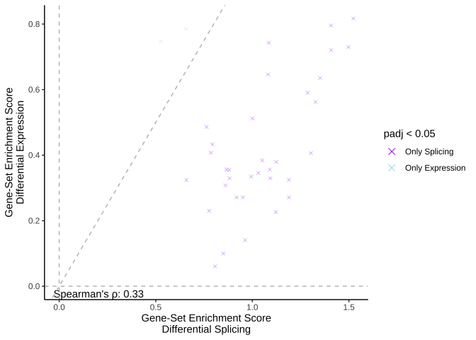

<!-- README.md is generated from README.Rmd. Please edit that file -->

# pairedGSEA

<!-- badges: start -->

[](https://app.codecov.io/gh/shdam/pairedGSEA?branch=master)
<!-- badges: end -->

`pairedGSEA` is an R package that helps you to run a paired differential
gene expression (DGE) and splicing (DGS) analysis. Providing a bulk RNA
count data, `pairedGSEA` combines the results of `DESeq2` (DGE) and
`DEXSeq` (DGS), aggregates the p-values to gene level, and allows you to
run a subsequent gene set over-representation analysis using its
implementation of the `fgsea::fora` function.

## Article

`pairedGSEA` is published in [BMC
Biology](https://doi.org/10.1186/s12915-023-01724-w).

Please cite with `citation("pairedGSEA")`

## Installation

Dependencies

``` r
# Install Bioconductor dependencies
if (!require("BiocManager", quietly = TRUE))
    install.packages("BiocManager")

BiocManager::install(c("SummarizedExperiment", "S4Vectors", "DESeq2", "DEXSeq", "fgsea", "sva", "BiocParallel"))
```

Install `pairedGSEA` from Bioconductor

``` r
if (!require("BiocManager", quietly = TRUE))
    install.packages("BiocManager")

BiocManager::install("pairedGSEA")
```

Install development version from GitHub

``` r
# Install pairedGSEA from github
devtools::install_github("shdam/pairedGSEA", build_vignettes = TRUE)
```

## Documentation

To view documentation for the version of this package installed in your
system, start R and enter:

``` r
browseVignettes("pairedGSEA")
```

## Interoperability with IsoformSwitchAnalyzeR

[IsoformSwitchAnalyzeR](https://github.com/kvittingseerup/IsoformSwitchAnalyzeR)
identifies, annotates, and visualizes Isoform Switches with Functional
Consequences (from RNA-seq data).

Import and export between the packages with:

- **`IsoformSwitchAnalyzeR::importPairedGSEA()`**
- **`IsoformSwitchAnalyzeR::exportToPairedGSEA()`**

## Usage

Please see the User Guide vignette for a detailed description of usage.

Here is a quick run-through of the functions:

<br> Load example data.

``` r
suppressPackageStartupMessages(library("SummarizedExperiment"))
library("pairedGSEA")

data("example_se")
example_se
#> class: SummarizedExperiment 
#> dim: 5611 6 
#> metadata(0):
#> assays(1): counts
#> rownames(5611): ENSG00000282880:ENST00000635453
#>   ENSG00000282880:ENST00000635195 ... ENSG00000249230:ENST00000504393
#>   ENSG00000249244:ENST00000505994
#> rowData names(0):
#> colnames(6): GSM1499784 GSM1499785 ... GSM1499791 GSM1499792
#> colData names(5): study id source final_description group_nr
```

Run paired differential analysis

``` r
set.seed(500) # For reproducible results

diff_results <- paired_diff(
  example_se,
  group_col = "group_nr",
  sample_col = "id",
  baseline = 1,
  case = 2,
  store_results = FALSE,
  quiet = TRUE
  )
#> No significant surrogate variables
#> converting counts to integer mode
#> Warning in DESeqDataSet(rse, design, ignoreRank = TRUE): some variables in
#> design formula are characters, converting to factors
```

Over-representation analysis of results

``` r
# Define gene sets in your preferred way
gene_sets <- pairedGSEA::prepare_msigdb(
    species = "Homo sapiens",
    db_species = "HS",
    collection = "C5",
    gene_id_type = "ensembl_gene"
    )

ora <- paired_ora(
  paired_diff_result = diff_results,
  gene_sets = gene_sets
  )
#> Running over-representation analyses
#> Joining result
```

You can now plot the enrichment scores against each other and identify
pathways of interest.

``` r
plot_ora(
    ora, 
    paired = FALSE # Available in version 1.1.0 and newer
    ) +
    ggplot2::theme_classic()
```



## Report issues

If you have any issues or questions regarding the use of `pairedGSEA`,
please do not hesitate to raise an issue on GitHub. In this way, others
may also benefit from the answers and discussions.
